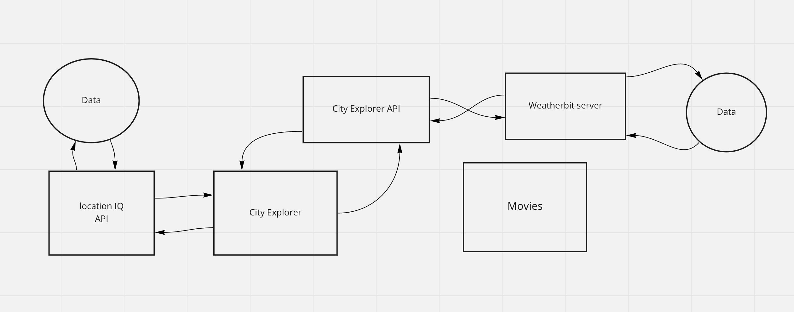
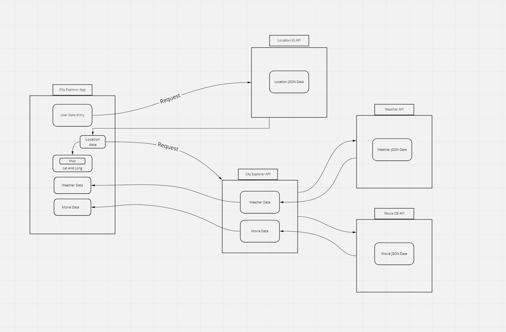
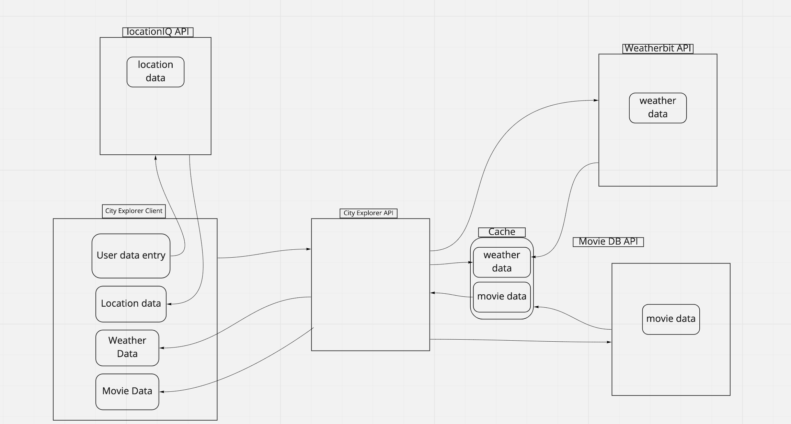

# city-explorer-api

**Author**: Spencer Tower
**Version**: 1.0.0 (increment the patch/fix version number if you make more commits past your first submission)

## Overview
<!-- Provide a high level overview of what this application is and why you are building it, beyond the fact that it's an assignment for this class. (i.e. What's your problem domain?) -->
Express server to query weather data from Weatherbit

## Getting Started
<!-- What are the steps that a user must take in order to build this app on their own machine and get it running? -->

## Architecture
<!-- Provide a detailed description of the application design. What technologies (languages, libraries, etc) you're using, and any other relevant design information. -->
Technologies: Javascript, express, weatherbit API

## Change Log
<!-- Use this area to document the iterative changes made to your application as each feature is successfully implemented. Use time stamps. Here's an example:

01-01-2001 4:59pm - Application now has a fully-functional express server, with a GET route for the location resource. -->

## Credit and Collaborations
<!-- Give credit (and a link) to other people or resources that helped you build this application. -->
Jacob Choi
Kellen Linse

## Lab 07

### Data Flow

Name of feature: server setup

Estimate of time needed to complete: 1hr

Start time: 5pm

Finish time: 6pm

Actual time needed to complete: 1hr

Name of feature: Weather

Estimate of time needed to complete: _____

Start time: _____

Finish time: _____

Actual time needed to complete: 

## Lab 08

### Data Flow

Name of feature: Weather (live)

Estimate of time needed to complete: 3 hrs

Start time: _____

Finish time: _____

Actual time needed to complete: 

## Lab 09

## Lab 10

Name of feature: Cache

Estimate of time needed to complete: 2hrs

Start time: _____

Finish time: _____

Actual time needed to complete: _____